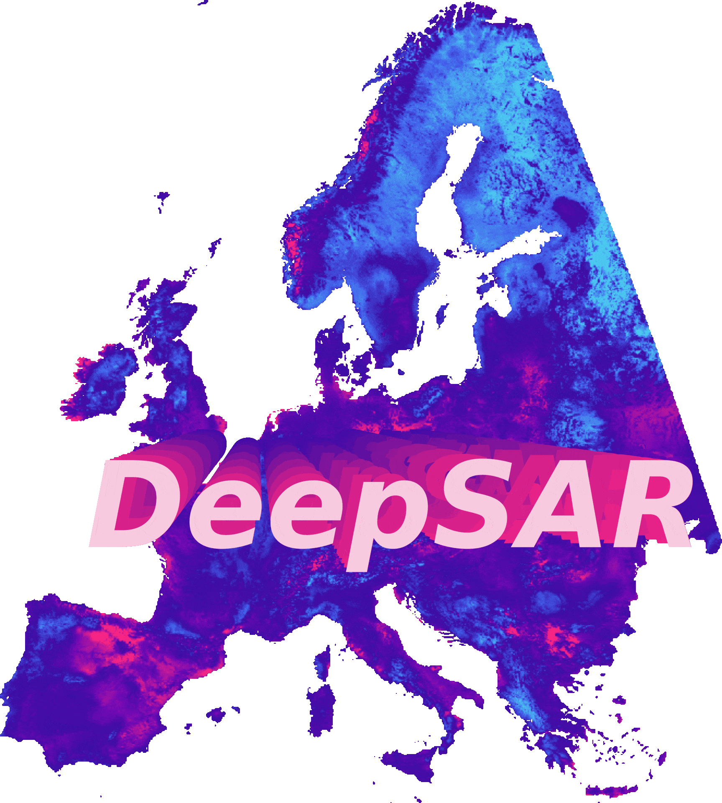

[](https://arxiv.org/abs/2507.06358)
[](https://opensource.org/licenses/MIT)
[](https://colab.research.google.com/github/vboussange/DeepSAR/blob/master/deepsar_demo.ipynb) 

<p align="center">
  
</p>

<!-- # DeepSAR: deep learning-based species-area relationship model  -->

Official implementation for

> **Deep learning-based species-area models reveal multi-scale patterns of species richness and turnover**  
> Victor Boussange, Philipp Brun, Johanna T. Malle, Gabriele Midolo, Jeanne Portier, Théophile Sanchez, Niklaus E. Zimmermann, Irena Axmanová, Helge Bruelheide, Milan Chytrý, Stephan Kambach, Zdeňka Lososová, Martin Večeřa, Idoia Biurrun, Klaus T. Ecker, Jonathan Lenoir, Jens-Christian Svenning, Dirk Nikolaus Karger. arXiv: [2507.06358](https://arxiv.org/abs/2507.06358) (2025)

If you ❤️ the project, consider giving it a ⭐️.

## Quick Start

### Inference
We provide a self-contained tutorial to predict species richness maps from the paper's pretrained deep SAR model:  
[](https://colab.research.google.com/github/vboussange/DeepSAR/blob/master/deepsar_demo.ipynb)

### Training
To retrain the deep SAR model, follow these steps:

0. Ensure you have [all required data](#data) (biodiversity data and environmental features) under `data/`, and [install the project environment](#installation).
1. Generate training data using `scripts/data_processing/compile_eva_chelsa.py` (see also `scripts/data_processing/compile_gift_chelsa.py` for test data generation).
2. Train the ensemble model with `train.py`. The main architecture is `Deep4PWeibull`, defined in `deepsar/deep4pweibull.py`.
3. Generate predictions using `project.py` (see also [Inference](#inference)).

## Project Overview

- `deepsar/`: Utility functions for generating training samples and defining deep SAR models.
- `scripts/`: Pipelines for data processing, model training, and mapping predictions.
- `figures/`: Scripts to generate figures for the paper.
- `data/`: Contains [the data](#data) associated with the project.

## Installation

To install dependencies and set up the environment, ensure you have `uv` installed, then run:

```bash
uv sync
uv pip install torch --torch-backend=auto
uv pip install -e .
```

## Data

### European Vegetation Archive (EVA) Dataset

Anonymised vegetation plot data for training is located at `data/processed/EVA/anonymised` and consists of:

- `plot_data.parquet`: Metadata for vegetation plots.
- `species_data.parquet`: Anonymised species names per plot.

To obtain the full dataset, request access at [EVA database](https://euroveg.org/eva-database/).

### GIFT Database

Regional checklists from the [GIFT database](https://gift.uni-goettingen.de/home), harmonized with EVA, are provided as a test dataset under `data/processed/GIFT/anonymised`.

### Predictors

Bioclimatic variables from the CHELSA dataset were used as predictors. To download them (e.g., for [pretrained weights](#pretrained-weights)), navigate to `data/CHELSA/` and run:

```bash
wget --no-host-directories --force-directories --input-file=envidat.txt
```

### Pretrained Weights

Pretrained weights for the ensembled deep SAR model `deep4pweibull` are available at `scripts/results/train/`. See [Quick Start: Inference](#inference) for usage instructions.

# Citations

If you use the anonymised data, please cite:

```bibtex
@misc{boussange2025,
  title={Deep learning-based species-area models reveal multi-scale patterns of species richness and turnover}, 
  author={Victor Boussange and Philipp Brun and Johanna T. Malle and Gabriele Midolo and Jeanne Portier and Théophile Sanchez and Niklaus E. Zimmermann and Irena Axmanová and Helge Bruelheide and Milan Chytrý and Stephan Kambach and Zdeňka Lososová and Martin Večeřa and Idoia Biurrun and Klaus T. Ecker and Jonathan Lenoir and Jens-Christian Svenning and Dirk Nikolaus Karger},
  year={2025},
  eprint={2507.06358},
  archivePrefix={arXiv},
  primaryClass={q-bio.PE},
  url={https://arxiv.org/abs/2507.06358}, 
}
```

```bibtex
@article{weigelt2020,
  author = {Weigelt, Patrick and König, Christian and Kreft, Holger},
  title = {GIFT – A Global Inventory of Floras and Traits for macroecology and biogeography},
  journal = {Journal of Biogeography},
  volume = {47},
  number = {1},
  pages = {16-43},
  doi = {https://doi.org/10.1111/jbi.13623},
  eprint = {https://onlinelibrary.wiley.com/doi/pdf/10.1111/jbi.13623},
  year = {2020}
}
```

```bibtex
@article{chytry2016,
  title = {European Vegetation Archive (EVA): An Integrated Database of European Vegetation Plots},
  author = {Chytr{\'y}, Milan and Hennekens, Stephan M. and {Jim{\'e}nez-Alfaro}, Borja and Knollov{\'a}, Ilona and Dengler, J{\"u}rgen and Jansen, Florian and Landucci, Flavia and Schamin{\'e}e, Joop H.J. and A{\'c}i{\'c}, Svetlana and Agrillo, Emiliano and Ambarl{\i}, Didem and Angelini, Pierangela and Apostolova, Iva and Attorre, Fabio and Berg, Christian and Bergmeier, Erwin and Biurrun, Idoia and {Botta-Duk{\'a}t}, Zolt{\'a}n and Brisse, Henry and Campos, Juan Antonio and Carl{\'o}n, Luis and {\v C}arni, Andra{\v z} and Casella, Laura and Csiky, J{\'a}nos and {\'C}u{\v s}terevska, Renata and Daji{\'c} Stevanovi{\'c}, Zora and Danihelka, Ji{\v r}{\'i} and De Bie, Els and {de Ruffray}, Patrice and De Sanctis, Michele and Dickor{\'e}, W. Bernhard and Dimopoulos, Panayotis and Dubyna, Dmytro and Dziuba, Tetiana and Ejrn{\ae}s, Rasmus and Ermakov, Nikolai and Ewald, J{\"o}rg and Fanelli, Giuliano and {Fern{\'a}ndez-Gonz{\'a}lez}, Federico and FitzPatrick, {\'U}na and Font, Xavier and {Garc{\'i}a-Mijangos}, Itziar and Gavil{\'a}n, Rosario G. and Golub, Valentin and Guarino, Riccardo and Haveman, Rense and Indreica, Adrian and I{\c s}{\i}k G{\"u}rsoy, Deniz and Jandt, Ute and Janssen, John A.M. and Jirou{\v s}ek, Martin and K{\k a}cki, Zygmunt and Kavgac{\i}, Ali and Kleikamp, Martin and Kolomiychuk, Vitaliy and Krstivojevi{\'c} {\'C}uk, Mirjana and Krstono{\v s}i{\'c}, Daniel and Kuzemko, Anna and Lenoir, Jonathan and Lysenko, Tatiana and Marcen{\`o}, Corrado and Martynenko, Vassiliy and Michalcov{\'a}, Dana and Moeslund, Jesper Erenskjold and Onyshchenko, Viktor and Pedashenko, Hristo and {P{\'e}rez-Haase}, Aaron and Peterka, Tom{\'a}{\v s} and Prokhorov, Vadim and Ra{\v s}omavi{\v c}ius, Valerijus and {Rodr{\'i}guez-Rojo}, Maria Pilar and Rodwell, John S. and Rogova, Tatiana and Ruprecht, Eszter and R{\=u}si{\c n}a, Solvita and Seidler, Gunnar and {\v S}ib{\'i}k, Jozef and {\v S}ilc, Urban and {\v S}kvorc, {\v Z}eljko and Sopotlieva, Desislava and Stan{\v c}i{\'c}, Zvjezdana and Svenning, Jens-Christian and Swacha, Grzegorz and Tsiripidis, Ioannis and Turtureanu, Pavel Dan and U{\u g}urlu, Emin and Uogintas, Domas and Valachovi{\v c}, Milan and Vashenyak, Yulia and Vassilev, Kiril and Venanzoni, Roberto and Virtanen, Risto and Weekes, Lynda and Willner, Wolfgang and Wohlgemuth, Thomas and Yamalov, Sergey},
  year = {2016},
  journal = {Applied Vegetation Science},
  volume = {19},
  number = {1},
  pages = {173--180},
  issn = {1654-109X},
  doi = {10.1111/avsc.12191},
  urldate = {2024-05-17},
}
```