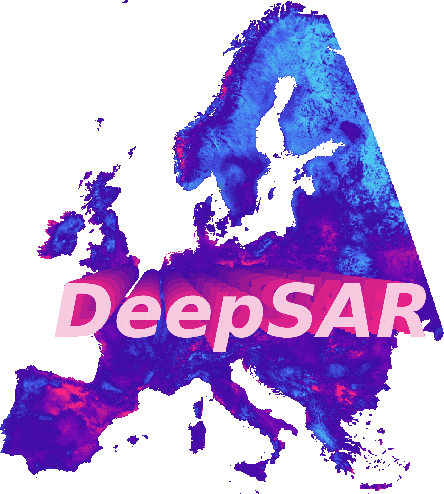

[](https://arxiv.org/abs/2507.06358)
[](https://opensource.org/licenses/MIT)
[](https://colab.research.google.com/github/vboussange/MuScaRi/blob/master/muscari_demo.ipynb) 

<p align="center">
  <!--  -->
  
</p>

<!-- # MuScaRi: deep learning-based species-area relationship model  -->

Official implementation for `MuScaRi`, from

> **Multi-scale species richness estimation with deep learning**  
> Victor Boussange, Bert Wuyts, Philipp Brun, Johanna T. Malle, Gabriele Midolo, Jeanne Portier, Théophile Sanchez, Niklaus E. Zimmermann, Irena Axmanová, Helge Bruelheide, Milan Chytrý, Stephan Kambach, Zdeňka Lososová, Martin Večeřa, Idoia Biurrun, Klaus T. Ecker, Jonathan Lenoir, Jens-Christian Svenning, Dirk Nikolaus Karger. arXiv: [2507.06358](https://arxiv.org/abs/2507.06358) (2025)

If you ❤️ the project, consider giving it a ⭐️.

## Quick Start

### Inference

Load the pretrained ensemble and inspect its required environmental features:

```python
from muscari import MuScaRiEnsemble
from muscari.data_processing.utils_features import EnvironmentalFeatureDataset

# Load pretrained ensemble from Hugging Face (no authentication needed)
model = MuScaRiEnsemble.from_pretrained("vboussange/muscari")
print(f"Ensemble with {model.n_models} members")
print("Required features:", model.feature_names)

# Load matching environmental features (auto-downloaded from vboussange/muscari-data)
env_dataset, lc_dataset = EnvironmentalFeatureDataset().load()
print("Available environmental variables:", list(env_dataset.data_vars))
```

For a full end-to-end prediction walkthrough, see the self-contained Colab tutorial:  
[](https://colab.research.google.com/github/vboussange/MuScaRi/blob/master/muscari_demo.ipynb)

### Training
To retrain the deep SAR model, follow these steps:

1. Build training datasets (see [Build training datasets](#build-training-datasets)).
2. Train the ensemble model with `scripts/train.py`. The main architecture is `MuScaRi`, and ensembles are handled by `MuScaRiEnsemble`.

## Project Overview

- `muscari/`: Utility functions for generating training samples and building `MuScaRi` models.
- `scripts/`: Pipelines for data processing, model training, and mapping predictions.
- `figures/`: Scripts to generate figures for the paper.
- `data/`: Contains [the data](#data) associated with the project.

## Installation

To install dependencies and set up the environment, ensure you have `uv` installed, then run:

```bash
uv sync
uv pip install torch --torch-backend=auto
uv pip install -e .
```

## Data

### Load datasets (recommended)

Use the built-in loaders to access the public MuScaRi data hosted on Hugging Face (`vboussange/muscari-data`).

```python
from muscari.data_processing.utils_eva import EVADataset
from muscari.data_processing.utils_gift import GIFTDataset
from muscari.data_processing.utils_features import EnvironmentalFeatureDataset

eva_df = EVADataset().load()
gift_df = GIFTDataset().load()
env_ds, lc_ds = EnvironmentalFeatureDataset().load()
```

- **EVA**: sanitized and anonymized vegetation-plot dataset used for model development and training.
- **GIFT**: independent regional checklist dataset used for external evaluation/extrapolation, aligned with the EVA dataset.
- **Environmental Features**: CHELSA climate variables, DEM elevation, and landcover predictors.

These datasets have been compiled from raw sources; see below for details.

### Building training samples

See `compile_sbcv_eva_samples.py` and `compile_gift_samples.py`

### Compile datasets from scratch (advanced / optional)

#### 1) Download raw datasets

For each dataset (EVA/GIFT/EnvironmentalFeatures), a specific instruction file is provided at:

- `data/raw/DATASETNAME/readme.md`

Follow these readmes to download and place raw files correctly.

#### 2) Preprocess and anonymise EVA/GIFT

Run the following scripts in order (from `scripts/data_processing/`):

1. `eva_preprocessing.py`: sanitize EVA data.
2. `gift_preprocessing.py`: sanitize GIFT data.
3. `anonymise_gift_eva.py`: anonymise species names in both datasets.

#### 3) Build training datasets

- Spatial Block Cross-Validation (SBCV) EVA datasets:
  - `compile_sbcv_eva_datasets.py`

### Pretrained Weights

Pretrained weights for the ensembled MuScaRi model are available on Hugging Face. See [Quick Start: Inference](#inference) and `muscari_demo.ipynb` for usage instructions.

# Citations

If you use the anonymised data, please cite:

```bibtex
@misc{boussange2025,
  title={Multi-scale species richness estimation with deep learning}, 
  author={Victor Boussange and Bert Wuyts and Philipp Brun and Johanna T. Malle and Gabriele Midolo and Jeanne Portier and Théophile Sanchez and Niklaus E. Zimmermann and Irena Axmanová and Helge Bruelheide and Milan Chytrý and Stephan Kambach and Zdeňka Lososová and Martin Večeřa and Idoia Biurrun and Klaus T. Ecker and Jonathan Lenoir and Jens-Christian Svenning and Dirk Nikolaus Karger},
  year={2025},
  eprint={2507.06358},
  archivePrefix={arXiv},
  primaryClass={q-bio.PE},
  url={https://arxiv.org/abs/2507.06358}, 
}
```

```bibtex
@article{weigelt2020,
  author = {Weigelt, Patrick and König, Christian and Kreft, Holger},
  title = {GIFT – A Global Inventory of Floras and Traits for macroecology and biogeography},
  journal = {Journal of Biogeography},
  volume = {47},
  number = {1},
  pages = {16-43},
  doi = {https://doi.org/10.1111/jbi.13623},
  eprint = {https://onlinelibrary.wiley.com/doi/pdf/10.1111/jbi.13623},
  year = {2020}
}
```

```bibtex
@article{chytry2016,
  title = {European Vegetation Archive (EVA): An Integrated Database of European Vegetation Plots},
  author = {Chytr{\'y}, Milan and Hennekens, Stephan M. and {Jim{\'e}nez-Alfaro}, Borja and Knollov{\'a}, Ilona and Dengler, J{\"u}rgen and Jansen, Florian and Landucci, Flavia and Schamin{\'e}e, Joop H.J. and A{\'c}i{\'c}, Svetlana and Agrillo, Emiliano and Ambarl{\i}, Didem and Angelini, Pierangela and Apostolova, Iva and Attorre, Fabio and Berg, Christian and Bergmeier, Erwin and Biurrun, Idoia and {Botta-Duk{\'a}t}, Zolt{\'a}n and Brisse, Henry and Campos, Juan Antonio and Carl{\'o}n, Luis and {\v C}arni, Andra{\v z} and Casella, Laura and Csiky, J{\'a}nos and {\'C}u{\v s}terevska, Renata and Daji{\'c} Stevanovi{\'c}, Zora and Danihelka, Ji{\v r}{\'i} and De Bie, Els and {de Ruffray}, Patrice and De Sanctis, Michele and Dickor{\'e}, W. Bernhard and Dimopoulos, Panayotis and Dubyna, Dmytro and Dziuba, Tetiana and Ejrn{\ae}s, Rasmus and Ermakov, Nikolai and Ewald, J{\"o}rg and Fanelli, Giuliano and {Fern{\'a}ndez-Gonz{\'a}lez}, Federico and FitzPatrick, {\'U}na and Font, Xavier and {Garc{\'i}a-Mijangos}, Itziar and Gavil{\'a}n, Rosario G. and Golub, Valentin and Guarino, Riccardo and Haveman, Rense and Indreica, Adrian and I{\c s}{\i}k G{\"u}rsoy, Deniz and Jandt, Ute and Janssen, John A.M. and Jirou{\v s}ek, Martin and K{\k a}cki, Zygmunt and Kavgac{\i}, Ali and Kleikamp, Martin and Kolomiychuk, Vitaliy and Krstivojevi{\'c} {\'C}uk, Mirjana and Krstono{\v s}i{\'c}, Daniel and Kuzemko, Anna and Lenoir, Jonathan and Lysenko, Tatiana and Marcen{\`o}, Corrado and Martynenko, Vassiliy and Michalcov{\'a}, Dana and Moeslund, Jesper Erenskjold and Onyshchenko, Viktor and Pedashenko, Hristo and {P{\'e}rez-Haase}, Aaron and Peterka, Tom{\'a}{\v s} and Prokhorov, Vadim and Ra{\v s}omavi{\v c}ius, Valerijus and {Rodr{\'i}guez-Rojo}, Maria Pilar and Rodwell, John S. and Rogova, Tatiana and Ruprecht, Eszter and R{\=u}si{\c n}a, Solvita and Seidler, Gunnar and {\v S}ib{\'i}k, Jozef and {\v S}ilc, Urban and {\v S}kvorc, {\v Z}eljko and Sopotlieva, Desislava and Stan{\v c}i{\'c}, Zvjezdana and Svenning, Jens-Christian and Swacha, Grzegorz and Tsiripidis, Ioannis and Turtureanu, Pavel Dan and U{\u g}urlu, Emin and Uogintas, Domas and Valachovi{\v c}, Milan and Vashenyak, Yulia and Vassilev, Kiril and Venanzoni, Roberto and Virtanen, Risto and Weekes, Lynda and Willner, Wolfgang and Wohlgemuth, Thomas and Yamalov, Sergey},
  year = {2016},
  journal = {Applied Vegetation Science},
  volume = {19},
  number = {1},
  pages = {173--180},
  issn = {1654-109X},
  doi = {10.1111/avsc.12191},
}
```
